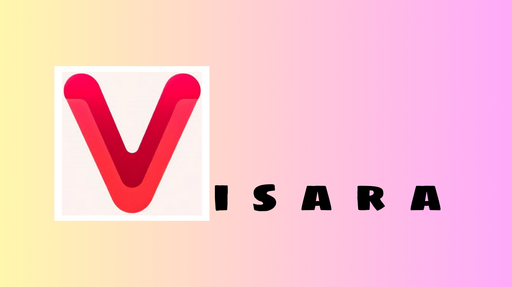
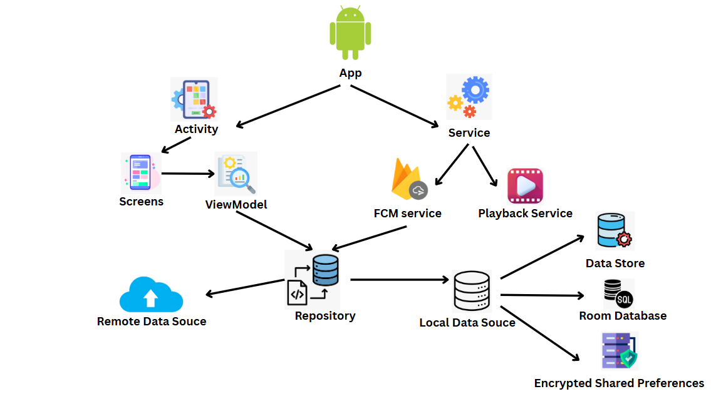

<!-- <a href="https://play.google.com/store/apps/details?id=com.google.samples.apps.nowinandroid"></a> -->

Visara App
==================
Visara is a Kotlin-based Android native app built with Jetpack Compose for sharing and watching videos, featuring adaptive streaming, push notifications, and social interactions such as like, comment, and follow.

## Features
- Adaptive video streaming using MPEG-DASH and ExoPlayer
- Background audio playback and media session support
- Video upload using WorkManager (handles large files & background)
- Real-time push notifications with Firebase Cloud Messaging
- Multilingual support (English, Vietnamese)
- User profiles, feeds, likes, comments, and follows
- Dynamic theme switching (Light / Dark / System)
- QR code scanning for quick profile access

## Tech Stack
- **Core:** Android, Kotlin, Jetpack Compose, Jetpack Media3, Dagger/Hilt  
- **Networking:** OkHttp  
- **Storage:** Room Database, DataStore, EncryptedSharedPreferences  
- **Notifications:** Firebase Cloud Messaging  
- **Others:** WorkManager, Google ML Kit (Barcode Scanner)

## Architecture



## Screenshots


## Setup
**1. Clone project**
    ```bash
    git clone https://github.com/lmkha/visara-android-app.git
    ```
2. [Add local.properties(env)](docs/setup_local_properties.md)
**3. Setup FCM:**
   - Create new firebase project
   - Go to Project Overview -> Project settings
   - Download **google-services.json** file in **Android apps** section
   - Put **google-services.json** in **project/app** folder
        ```
        visara-android-app/
        │
        ├── app/
        │   ├── Sgoogle-services.json 
        │   └...
        ...
        ```
